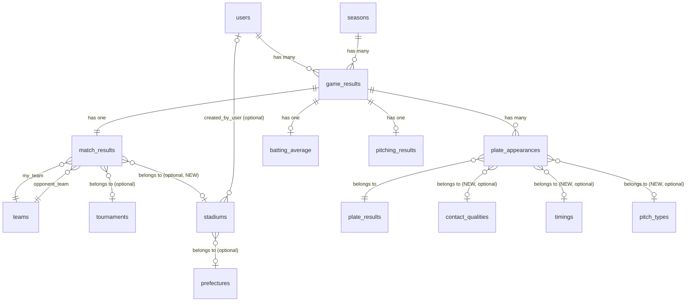

# 01. データモデル / マイグレーション SQL

**親ドキュメント**: `../game-record-update-design-doc.md`
**関連 Issue**: #330

---

## 1. ER図（Mermaid）



**変更点ハイライト**:
- 新規テーブル: `stadiums`, `pitch_types`, `contact_qualities`, `timings`
- 拡張: `plate_appearances`（多数のカラム追加）/ `match_results.stadium_id`
- 打球方向 (`hit_direction_id`) は `plate_appearances` の素の integer 列で保存し、id→name は `Stats::HitDirectionAggregator::DIRECTION_LABELS` 定数で管理（マスタテーブル無し）
- 既存テーブル削除・カラム削除なし

---

## 2. テーブル定義

### 2.1 既存テーブルの拡張

#### 2.1.1 `plate_appearances` カラム追加

```ruby
class AddColumnsToPlateAppearances < ActiveRecord::Migration[7.1]
  def change
    add_column :plate_appearances, :out_type, :integer
    add_column :plate_appearances, :hit_type, :integer
    add_column :plate_appearances, :rbi, :integer
    add_column :plate_appearances, :run_scored, :integer
    add_column :plate_appearances, :stolen_bases, :integer
    add_column :plate_appearances, :caught_stealing, :integer

    add_column :plate_appearances, :final_balls, :integer
    add_column :plate_appearances, :final_strikes, :integer
    add_column :plate_appearances, :final_outs, :integer
    add_column :plate_appearances, :first_pitch_swing, :boolean
    add_column :plate_appearances, :runners_state, :integer
    add_column :plate_appearances, :inning, :integer

    add_reference :plate_appearances, :contact_quality, foreign_key: true, null: true, index: true
    add_reference :plate_appearances, :timing, foreign_key: true, null: true, index: true
    add_reference :plate_appearances, :pitch_type, foreign_key: true, null: true, index: true

    add_column :plate_appearances, :self_analysis_memo, :text
    add_column :plate_appearances, :opponent_memo, :text

    add_column :plate_appearances, :hit_location_x, :decimal, precision: 5, scale: 4
    add_column :plate_appearances, :hit_location_y, :decimal, precision: 5, scale: 4
  end
end
```

**追加カラム一覧**:

| カラム | 型 | NULL | デフォルト | 説明 |
|--------|-----|------|-----------|------|
| `out_type` | integer | YES | NULL | アウト種別 enum（1: ゴロ, 2: フライ, 3: ライナー, 4: 併殺打, 5: ファールフライ） |
| `hit_type` | integer | YES | NULL | ヒット種別 enum（1: 単打, 2: 二塁打, 3: 三塁打, 4: 本塁打） |
| `rbi` | integer | YES | NULL | 打点 |
| `run_scored` | integer | YES | NULL | 得点（自身が得点したか / 0 or 1） |
| `stolen_bases` | integer | YES | NULL | 盗塁数 |
| `caught_stealing` | integer | YES | NULL | 盗塁死数 |
| `final_balls` | integer | YES | NULL | 最終ボールカウント (0-3) |
| `final_strikes` | integer | YES | NULL | 最終ストライクカウント (0-2) |
| `final_outs` | integer | YES | NULL | 打席時のアウトカウント (0-2) |
| `first_pitch_swing` | boolean | YES | NULL | 初球打ちフラグ |
| `runners_state` | integer | YES | NULL | ランナー状況 enum (0-7) |
| `inning` | integer | YES | NULL | 何回（1-99 任意） |
| `contact_quality_id` | bigint | YES | NULL | FK → contact_qualities |
| `timing_id` | bigint | YES | NULL | FK → timings |
| `pitch_type_id` | bigint | YES | NULL | FK → pitch_types |
| `self_analysis_memo` | text | YES | NULL | 自己分析メモ |
| `opponent_memo` | text | YES | NULL | 対戦相手・配球メモ |
| `hit_location_x` | decimal(5,4) | YES | NULL | 正規化座標 0.0000-1.0000 |
| `hit_location_y` | decimal(5,4) | YES | NULL | 正規化座標 0.0000-1.0000 |

**注意**:
- すべて nullable で追加 → 既存レコードへの影響なし
- 既存カラム（`batting_result`, `plate_result_id`, `hit_direction_id`, `batting_position_id`, `batter_box_number`）は **一切変更しない**
- enum 値は Rails モデル側で定義（DB は integer）

#### 2.1.2 `match_results` への球場ID追加

```ruby
class AddStadiumIdToMatchResults < ActiveRecord::Migration[7.1]
  def change
    add_reference :match_results, :stadium, foreign_key: true, null: true, index: true
  end
end
```

### 2.2 新規マスタテーブル

#### 2.2.1 `stadiums`

```ruby
class CreateStadiums < ActiveRecord::Migration[7.1]
  def change
    create_table :stadiums do |t|
      t.string :name, null: false
      t.references :prefecture, foreign_key: true, null: true, index: true
      t.references :created_by_user, foreign_key: { to_table: :users }, null: true, index: true
      t.timestamps
    end
    add_index :stadiums, :name
  end
end
```

| カラム | 型 | NULL | 説明 |
|--------|-----|------|------|
| `id` | bigint PK | NO | |
| `name` | string | NO | 球場名 |
| `prefecture_id` | bigint FK | YES | 都道府県 |
| `created_by_user_id` | bigint FK | YES | ユーザー追加分の追跡 |

#### 2.2.2 `pitch_types`

```ruby
class CreatePitchTypes < ActiveRecord::Migration[7.1]
  def change
    create_table :pitch_types do |t|
      t.string :name, null: false
      t.integer :display_order, null: false, default: 0
      t.timestamps
    end
    add_index :pitch_types, :display_order
  end
end
```

初期データ（data migration で投入）:

| id | name | display_order |
|----|------|---------------|
| 1 | ストレート系 | 1 |
| 2 | ツーシーム系 | 2 |
| 3 | カット系 | 3 |
| 4 | シュート系 | 4 |
| 5 | スライダー系 | 5 |
| 6 | カーブ系 | 6 |
| 7 | シンカー系 | 7 |
| 8 | フォーク系 | 8 |
| 9 | スプリット系 | 9 |
| 10 | チェンジアップ系 | 10 |

#### 2.2.3 `contact_qualities`

```ruby
class CreateContactQualities < ActiveRecord::Migration[7.1]
  def change
    create_table :contact_qualities do |t|
      t.string :name, null: false
      t.integer :display_order, null: false, default: 0
      t.timestamps
    end
    add_index :contact_qualities, :display_order
  end
end
```

初期データ:

| id | name | display_order |
|----|------|---------------|
| 1 | 真芯 | 1 |
| 2 | 先っぽ | 2 |
| 3 | 詰まり | 3 |
| 4 | 擦り | 4 |
| 5 | ドライブ | 5 |

#### 2.2.4 `timings`

```ruby
class CreateTimings < ActiveRecord::Migration[7.1]
  def change
    create_table :timings do |t|
      t.string :name, null: false
      t.integer :display_order, null: false, default: 0
      t.timestamps
    end
    add_index :timings, :display_order
  end
end
```

初期データ:

| id | name | display_order |
|----|------|---------------|
| 1 | ドンピシャ | 1 |
| 2 | 泳ぎ気味 | 2 |
| 3 | 遅れ気味 | 3 |

---

## 3. Enum 定義（Rails モデル）

### 3.1 `PlateAppearance` モデル

```ruby
class PlateAppearance < ApplicationRecord
  belongs_to :game_result
  belongs_to :user
  belongs_to :contact_quality, optional: true
  belongs_to :timing, optional: true
  belongs_to :pitch_type, optional: true

  enum out_type: {
    ground_out: 1,
    fly_out: 2,
    line_out: 3,
    double_play: 4,
    foul_fly: 5
  }, _prefix: true

  enum hit_type: {
    single: 1,
    double: 2,
    triple: 3,
    home_run: 4
  }, _prefix: true

  enum runners_state: {
    bases_empty: 0,
    first: 1,
    second: 2,
    third: 3,
    first_second: 4,
    first_third: 5,
    second_third: 6,
    bases_loaded: 7
  }, _prefix: true

  # 得点圏（2塁・3塁・一二・一三・二三・満塁）
  scope :in_scoring_position, -> { where(runners_state: 2..7) }

  # 初球打ち
  scope :first_pitch_swung, -> { where(first_pitch_swing: true) }

  # ボール先行（最終B > 最終S）
  scope :ahead_in_count, -> { where('final_balls > final_strikes') }

  # 追い込まれ（最終S = 2）
  scope :behind_in_count, -> { where(final_strikes: 2) }

  validates :hit_location_x, :hit_location_y,
            numericality: { greater_than_or_equal_to: 0.0, less_than_or_equal_to: 1.0 },
            allow_nil: true
end
```

### 3.2 各マスタモデル

```ruby
class Stadium < ApplicationRecord
  belongs_to :prefecture, optional: true
  belongs_to :created_by_user, class_name: 'User', optional: true
  has_many :match_results
  validates :name, presence: true
  scope :ordered, -> { order(:name) }
end

class PitchType < ApplicationRecord
  has_many :plate_appearances
  validates :name, presence: true
  scope :ordered, -> { order(:display_order) }
end

# ContactQuality / Timing / HitDepth も同パターン
```

---

## 4. インデックス戦略

### 4.1 既存インデックス（変更なし）

- `plate_appearances`: `game_result_id`, `user_id` （既存）

### 4.2 新規インデックス

| テーブル | カラム | 用途 |
|---------|--------|------|
| `plate_appearances` | `contact_quality_id` | 打球の質分析 |
| `plate_appearances` | `timing_id` | タイミング分析 |
| `plate_appearances` | `pitch_type_id` | 球種別分析 |
| `match_results` | `stadium_id` | 球場別分析 |
| `stadiums` | `name` | 検索 |
| `pitch_types` | `display_order` | 表示順 |
| `contact_qualities` | `display_order` | 表示順 |
| `timings` | `display_order` | 表示順 |

### 4.3 検討中（必要に応じ後追い追加）

- `plate_appearances` の複合 index: 状況別分析クエリのパフォーマンスを見て判断
  - `(user_id, runners_state)` 得点圏打率向け
  - `(user_id, first_pitch_swing)` 初球打率向け
- 初期は不要、本番でN+1や遅延が発生した時点で追加

---

## 5. `batting_average` 自動再計算

### 5.1 計算ロジック

```ruby
# app/services/stats/batting_average_recalculator.rb
class Stats::BattingAverageRecalculator
  def initialize(game_result)
    @game_result = game_result
  end

  def call
    return unless new_format_game?

    BattingAverage.upsert(build_stats, unique_by: :game_result_id)
  end

  private

  def new_format_game?
    # 新仕様で記録された試合のみ対象
    # = いずれかの plate_appearance が新カラムを持つ
    @game_result.plate_appearances.where.not(out_type: nil)
      .or(@game_result.plate_appearances.where.not(hit_type: nil))
      .exists?
  end

  def build_stats
    # plate_appearances から集計値を算出
    # ...
  end
end
```

### 5.2 `PlateAppearance` モデルのコールバック

```ruby
class PlateAppearance < ApplicationRecord
  after_commit :recalculate_batting_average

  private

  def recalculate_batting_average
    return unless new_format?
    Stats::BattingAverageRecalculator.new(game_result).call
  end

  def new_format?
    out_type.present? || hit_type.present? || plate_result_id.present?
  end
end
```

### 5.3 既存データ保全（最重要）

- **既存試合（打席詳細なし）の `batting_average` は再計算対象から除外**
- 判定: 「いずれかの `plate_appearance` が `out_type` または `hit_type` を持つ」場合のみ新仕様試合とみなす
- 既存試合は `batting_average` の値をそのまま維持

---

## 6. マイグレーション実行順序

```
1. 20260520_create_stadiums.rb
2. 20260520_create_pitch_types.rb
3. 20260520_create_contact_qualities.rb
4. 20260520_create_timings.rb
5. 20260520_add_stadium_id_to_match_results.rb
6. 20260520_add_columns_to_plate_appearances.rb
7. 20260520_seed_master_data.rb (data-only migration)
```

すべて非破壊（カラム追加・新規テーブル作成・データ投入のみ）。

---

## 7. ロールバック設計

すべてのマイグレーションは `change` メソッドで定義し、`db:rollback` で安全に巻き戻せる:

- 新規テーブル → `drop_table`
- カラム追加 → `remove_column`
- データ投入 → 該当 enum 値の seed のみ削除（既存マスタIDは触らない）

---

## 8. 既存データ保全 検証チェックリスト

### 8.1 マイグレーション前後のデータダンプ

```bash
# マイグレーション前
docker compose exec back bundle exec rails runner "
  puts PlateAppearance.count
  puts BattingAverage.count
  puts BattingAverage.where('at_bats > 0').sum(:at_bats)
  puts BattingAverage.where('hit > 0').sum(:hit)
  puts BattingAverage.where('home_run > 0').sum(:home_run)
"

# マイグレーション実行
docker compose exec back bundle exec rails db:migrate

# マイグレーション後（上と同じスクリプト）
# → 結果が完全一致することを確認
```

### 8.2 RSpec 保全テスト（必須）

```ruby
# spec/migrations/preserve_existing_data_spec.rb (仮)
RSpec.describe '既存データ保全' do
  context 'マイグレーション後' do
    it '既存 plate_appearances レコードのカラム値が変わらない' do
      # ...
    end

    it '既存 batting_average の集計値が変わらない' do
      # ...
    end

    it '既存 plate_results のID/nameが保持される' do
      # ...
    end
  end

  context 'after_commit 自動再計算' do
    it '既存試合（打席詳細なし）の batting_average は再計算されない' do
      # ...
    end

    it '新仕様試合のみ自動再計算される' do
      # ...
    end
  end
end
```

### 8.3 ステージング検証

- 本番DBクローンに対し上記マイグレーションを試行
- 8.1 のスクリプトで件数・集計値を比較
- 既存ユーザーの試合詳細・ランキングが従来通り表示されることを目視確認

### 8.4 リリース後監視

- 最初 24-48 時間は Sentry で `BattingAverage` / `PlateAppearance` 関連エラーを重点監視
- Stats 系 API のエラー率を確認
